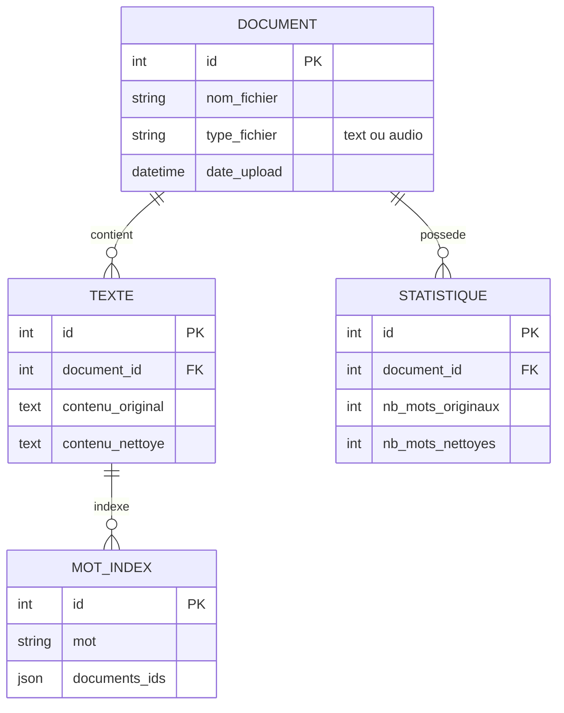

# InsightAI : Traitement de Texte et Recherche Intelligente

Application web Django pour l'analyse de texte, la transcription audio et la recherche documentaire avec chatbot intégré.

## 📋 Description

Cette application web permet de gérer, analyser et rechercher dans une collection de documents textuels et audio. Elle combine des techniques de traitement du langage naturel (NLP), de recherche booléenne et d'intelligence artificielle pour offrir une expérience complète d'exploration documentaire.

### Fonctionnalités principales

- **Upload de fichiers** : Support des fichiers texte et audio
- **Transcription automatique** : Conversion des fichiers audio en texte via Whisper
- **Analyse NLP** : Prétraitement complet avec statistiques détaillées
- **Recherche booléenne** : Système de recherche avec opérateurs AND/OR
- **Visualisations** : Tableaux de bord avec graphiques et nuages de mots
- **Chatbot intelligent** : Assistant conversationnel basé sur GPT4All

## 🛠️ Technologies utilisées

### Backend & Frontend
- **Django** : Framework web principal (backend + templates)
- **SQLite** : Base de données pour le stockage des contenus
- **Python** : Langage de programmation

### Traitement audio & NLP
- **Whisper** : Transcription automatique de l'audio en texte
- **spaCy** : Lemmatisation et analyse linguistique
- **NLTK** : Tokenisation et suppression des stopwords

### Intelligence artificielle
- **GPT4All** : Modèle de langage local pour le chatbot

### Autres
- **JSON** : Stockage de l'index inversé
- **Matplotlib/Seaborn** : Génération de graphiques
- **WordCloud** : Création de nuages de mots

## 📁 Structure du projet

```
InsightAI/
├── manage.py
├── requirements.txt
├── README.md
├── app/
│   ├── models.py          # Modèles de données (Document, Texte)
│   ├── views.py           # Vues et logique métier
│   ├── urls.py            # Routes de l'application
│   ├── nlp_processor.py   # Pipeline de traitement NLP
│   ├── indexer.py         # Génération de l'index inversé
│   ├── search.py          # Moteur de recherche booléenne
│   ├── chatbot.py         # Intégration GPT4All
│   └── templates/
│       ├── base.html
│       ├── upload.html
│       ├── dashboard.html
│       ├── search.html
│       └── chatbot.html
├── static/
│   ├── css/
│   └── js/
└── media/
    ├── uploads/           # Fichiers uploadés
    └── wordclouds/        # Nuages de mots générés
```

## 🗄️ Modèle de données (Diagramme Entité-Relation)



## 🔄 Workflow de traitement

1. **Upload** : L'utilisateur télécharge un fichier texte ou audio
2. **Transcription** (si audio) : Whisper convertit l'audio en texte
3. **Stockage** : Le texte est sauvegardé dans SQLite avec référence au fichier source
4. **Prétraitement NLP** :
   - Conversion en minuscules
   - Tokenisation
   - Lemmatisation
   - Suppression des stopwords
   - Calcul des statistiques
5. **Indexation** : Mise à jour de l'index inversé JSON
6. **Visualisation** : Génération des graphiques et nuages de mots

## 🔍 Système de recherche

### Syntaxe supportée

- `mot1 AND mot2` : Documents contenant les deux mots
- `mot1 OR mot2` : Documents contenant au moins un des mots
- `mot` : Recherche simple d'un terme

### Exemple

```
python AND django
# Retourne tous les documents contenant "python" ET "django"

machine OR apprentissage
# Retourne les documents contenant "machine" OU "apprentissage"
```

## 🤖 Chatbot

Le chatbot utilise GPT4All pour répondre aux questions basées sur le contenu des documents stockés. Il effectue une recherche contextuelle dans la base de données pour fournir des réponses pertinentes.

### Utilisation

1. Accéder à l'interface du chatbot
2. Poser une question en langage naturel
3. Le système recherche dans les documents pertinents
4. GPT4All génère une réponse contextualisée

## 📊 Tableau de bord

Le dashboard affiche :
- Nombre total de documents
- Nombre de mots avant/après nettoyage
- Mots les plus fréquents (tableau et graphique)
- Nuage de mots interactif
- Statistiques par document

## 📝 Dépendances principales

```
Django>=4.2
openai-whisper>=20231117
spacy>=3.5
nltk>=3.8
gpt4all>=1.0
matplotlib>=3.7
wordcloud>=1.9
numpy>=1.24
pandas>=2.0
```

## 👥 Auteur

- Thomas DA SILVA
- Université Paris 8 Vincennes - Saint-Denis 
- Master 2 Technologies de l’Hypermédia (THYP)

Ce README a été rédigé avec l'assistance de **Claude** (Anthropic), un assistant IA qui a aidé à structurer et formaliser la documentation du projet.

- **Modèle utilisé** : Claude Sonnet 4.5
- **Date** : Octobre 2025
- **Lien** : [Claude.ai](https://claude.ai)

### Prompt initial

Le projet a été défini selon le cahier des charges suivant :

Le projet consiste à créer une application web complète basée sur Django, utilisant SQLite comme base de données pour stocker tous les fichiers et contenus textuels. L’interface utilisateur sera construite avec les gabarits Django pour plus de simplicité, sans passer par une API séparée. L’application permettra à l’utilisateur d’uploader des fichiers texte et audio. Les fichiers audio seront automatiquement transcrits en texte grâce à Whisper, et tous les contenus textuels, qu’ils proviennent de fichiers texte originaux ou de transcriptions audio, seront stockés dans la base de données avec un lien vers leur fichier source. Une fois le texte récupéré, il sera prétraité avec des étapes de NLP telles que la conversion en minuscules, la tokenisation, la lemmatisation, la suppression des stopwords et le calcul de statistiques comme le nombre de mots supprimés et la fréquence des mots. Ces statistiques seront visualisées dans le tableau de bord de l’interface utilisateur, sous forme de tableaux, graphiques et nuages de mots. Parallèlement, une indexation inversée sera générée, stockée dans un fichier JSON, qui permettra de relier chaque mot aux fichiers dans lesquels il apparaît. Cette indexation servira au champ de recherche de l’interface : l’utilisateur pourra effectuer des recherches booléennes simples du type “mot1 AND mot2” ou “mot1 OR mot2” pour retrouver les documents correspondants. Enfin, un chatbot basé sur GPT4All sera intégré directement dans l’interface, capable de répondre aux questions de l’utilisateur à partir du contenu textuel stocké dans la base de données. L’ensemble du projet repose uniquement sur Python et Django pour le backend et le frontend, Whisper pour la transcription audio, spaCy et NLTK pour le traitement NLP, et JSON pour l’indexation, ce qui rend l’architecture simple, fonctionnelle et adaptée à un projet académique sans besoin de ressources serveur importantes.
