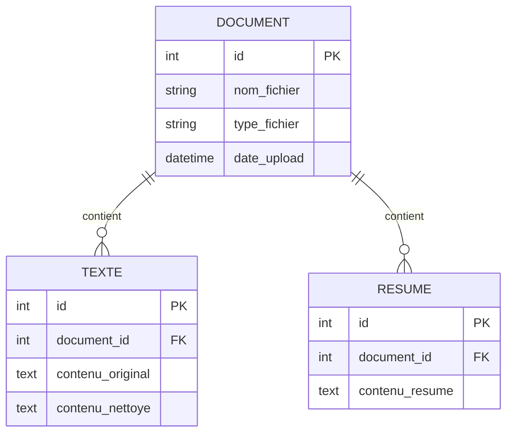

# rAIsume : Résumé Automatique de Documents

Application web de gestion documentaire avec génération automatique de résumés par IA.

## Objectif du projet

Cette application permet de :
- Uploader des documents (texte, PDF)
- Stocker les documents avec leurs métadonnées sémantiques
- Générer automatiquement des résumés via IA
- Exporter les données au format RDF/Turtle

## Technologies utilisées

- **PHP** : Logique serveur, gestion des uploads et des API
- **JavaScript** : Interface dynamique (résumés sans rechargement)
- **Omeka-S** : Gestion de base de données sémantique RDF
- **Ollama** : Génération de résumés en local (IA)
- **RDF/Turtle** : Représentation standardisée des métadonnées

## Structure du projet

```
/rAIsume
│
├── index.php          # Page principale
├── upload.php         # Gestion des uploads
├── resume.php         # Génération des résumés
├── readme.md
│
└── js/
    └── script.js      # Logique front-end
```

## Fonctionnement

1. **Upload** : L'utilisateur ajoute un document via formulaire
2. **Stockage** : Omeka-S enregistre le fichier + métadonnées RDF
3. **Résumé** : Clic sur "Générer résumé" → appel à Ollama
4. **Affichage** : Le résumé apparaît et est ajouté aux métadonnées

## Installation

### Prérequis
- PHP 7.4+
- Serveur web (Apache/Nginx)
- Omeka-S installé et configuré
- Ollama installé localement

## Métadonnées RDF

Chaque document possède des métadonnées Dublin Core :
- `dct:title` : Titre du document
- `dct:creator` : Auteur
- `dct:description` : Résumé généré
- `dct:source` : Fichier source

Export possible en format Turtle (.ttl) via Omeka-S.

## Modèle de données (Diagramme Entité-Relation)



## Auteur

- Thomas DA SILVA
- Université Paris 8 Vincennes - Saint-Denis 
- Master 2 Technologies de l’Hypermédia (THYP)

## Sources

Ce README a été rédigé avec l'assistance de **Claude** (Anthropic), un assistant IA qui a aidé à structurer et formaliser la documentation du projet.

- **Modèle utilisé** : Claude Sonnet 4.5
- **Date** : Octobre 2025
- **Lien** : [Claude.ai](https://claude.ai)

### Prompt initial

Le projet a été défini selon le cahier des charges suivant :

```
Crée un README pour une application web de gestion documentaire avec résumé automatique par IA. Le projet utilise PHP pour la logique serveur, JavaScript pour l'interface dynamique, Omeka-S comme base de données sémantique RDF, et Ollama pour générer les résumés localement. L'utilisateur upload un document (texte ou PDF), Omeka-S le stocke avec ses métadonnées RDF (titre, créateur, description selon Dublin Core), un bouton permet de générer un résumé via Ollama, et ce résumé est affiché puis ajouté comme métadonnée dans Omeka-S. L'architecture comprend index.php (page principale), upload.php (gestion des uploads vers Omeka-S API), resume.php (appel à Ollama via shell_exec), main.js (gestion du bouton résumer en fetch), et un dossier uploads. Les métadonnées sont exportables en format Turtle. Inclus dans le README : objectif, technologies utilisées, structure des fichiers, fonctionnement en étapes, et infos d'installation basiques.
```
